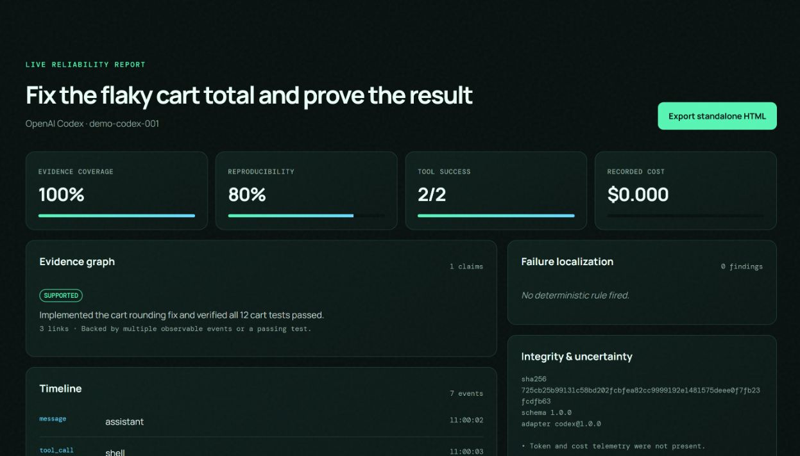
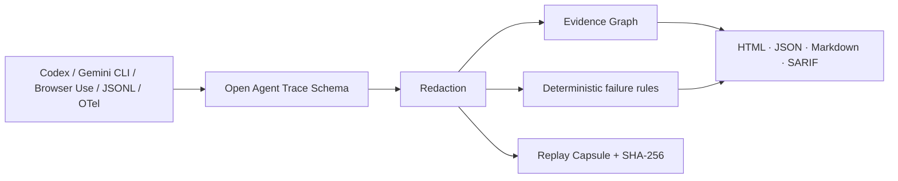

<p align="center"></p>

<p align="center"><strong>Evidence, not vibes, for agent runs.</strong></p>

<p align="center">Turn Codex, Gemini CLI, Browser Use, JSONL, and OpenTelemetry traces into evidence-linked reliability reports and replayable capsules—locally, without an API key.</p>

<p align="center"><a href="https://alex0ai.github.io/tracefact/">Live demo</a> · <a href="README.zh-CN.md">简体中文</a> · <a href="docs/technical-report.md">Technical report</a> · <a href="ROADMAP.md">Roadmap</a></p>



## The 60-second quick start

```bash
git clone https://github.com/Alex0AI/tracefact.git
cd tracefact
npm ci
npm run build
node dist/cli.js analyze examples/offline-demo.codex.jsonl --out report
```

Open `report/report.html`. It is standalone and works offline. The command also writes `report.json`, `report.md`, `report.sarif`, and a hash-verified `run.tracefact.gz` replay capsule.

Prefer the browser? Open the [live demo](https://alex0ai.github.io/tracefact/), drag in a trace, and export the report. The file never leaves the page.

## What goes in; what comes out; why it is credible



TraceFact does not hide correctness behind one LLM-as-judge score. It extracts explicit completion claims and links each one to observable tool results, tests, diffs, browser actions, sources, and artifact hashes. Every failure finding carries exact event IDs. Missing telemetry is shown as uncertainty.

## The original core

- **Open Agent Trace Schema (OATS) 1.0** — a versioned, extensible trace envelope with JSON Schema, strict TypeScript types, and migrations.
- **Evidence Graph** — `supported`, `weak`, `unsupported`, or `conflicting` claims with causal evidence edges and explanations.
- **Replay Capsule** — a portable, redacted, gzip-compressed run containing the normalized trace, environment summary, source metadata, report, and hashes. Review does not require the original model or API key.
- **Failure Taxonomy** — deterministic localization of loops, repeated calls, retrieval drift, unverified changes, failed tests, evidence-free completion, cost spikes, premature termination, and failed recovery.
- **Reliability Report** — standalone HTML plus JSON, Markdown, and SARIF. Benchmark scores remain scoped to their original benchmark.

## Adapters

| Adapter              | Status       | Public format used                                                     |
| -------------------- | ------------ | ---------------------------------------------------------------------- |
| OpenAI Codex         | Stable       | rollout `.jsonl`: session metadata, response items, event messages     |
| Gemini CLI           | Stable       | OpenTelemetry/log event spans and GenAI attributes                     |
| Browser Use          | Stable       | serialized `AgentHistoryList` steps, model actions, state, and results |
| Generic JSONL / OTel | Stable       | trace events or recursively discovered spans                           |
| OpenCode             | Experimental | session/message/part objects                                           |
| agent-browser        | Experimental | JSON command responses                                                 |
| OpenHands            | Experimental | action/observation event streams                                       |

Adapters are plugins. Implement the small `TraceAdapter` interface exported from `tracefact/adapter-sdk`; unknown fields are preserved in `attributes` or `extensions`.

## CLI

```text
tracefact analyze <trace> [--adapter auto] [--out tracefact-report]
tracefact replay <run.tracefact.gz> [--out replay.html]
tracefact verify <run.tracefact.gz>
tracefact migrate <old-trace.json> --out migrated.json
tracefact adapters
tracefact serve --dir web-dist --port 4173
```

## GitHub Action

```yaml
- uses: Alex0AI/tracefact/action@v0.1.0
  with:
    trace: artifacts/codex-rollout.jsonl
    adapter: auto
```

The action appends a job summary, updates a marker-based PR comment when `pull-requests: write` is granted, and uploads the full HTML/JSON/Markdown/SARIF/capsule bundle. No trace is sent to a third party.

## Read-only MCP server

```json
{
  "mcpServers": {
    "tracefact": {
      "command": "node",
      "args": ["/absolute/path/to/tracefact/dist/mcp.js"],
      "env": { "TRACEFACT_STORE": "/absolute/path/to/traces" }
    }
  }
}
```

Tools: `list_runs`, `get_run`, and `get_reliability_report`. There are no write tools.

## Small, reproducible evidence set

`dataset/generated/` contains 60 deterministic, CC0-1.0 synthetic traces spanning success, failed tests, tool loops, unsupported completion, cost anomalies, and successful recovery. Regenerate with `npm run dataset:generate`; evaluate with `npm run experiment`.

The v0.1 experiment reports micro precision **0.833**, recall **1.000**, and F1 **0.909** on rule-authored synthetic labels. All 10 apparent false positives are `hallucinated_completion` findings on fixtures whose primary label is `test_failure`: the completion claim conflicts with the failed test, but that secondary label was intentionally omitted. This exposes multi-label ambiguity rather than hiding it. The result is regression evidence, not proof of real-world generalization. See [the data card](dataset/DATACARD.md), [raw results](docs/experiment-results.json), and [technical report](docs/technical-report.md).

## Where TraceFact fits

| Project                                        | Primary job                            | Hosted tracing | Evidence-linked completion | Portable offline replay | Deterministic failure evidence |
| ---------------------------------------------- | -------------------------------------- | -------------: | -------------------------: | ----------------------: | -----------------------------: |
| TraceFact                                      | Post-run reliability and reproduction  |             No |                        Yes |                     Yes |                            Yes |
| [LangSmith](https://docs.smith.langchain.com/) | Tracing, evaluation, datasets          |            Yes |       Evaluation-dependent |                      No |                  Not its focus |
| [Langfuse](https://langfuse.com/docs)          | Open-source LLM observability          |       Optional |       Evaluation-dependent |   Export, not a capsule |                  Not its focus |
| [Phoenix](https://arize.com/docs/phoenix)      | Open-source AI observability and evals |       Optional |       Evaluation-dependent |                      No |                  Not its focus |
| [AgentOps](https://docs.agentops.ai/)          | Agent monitoring and session replay    |            Yes |       Evaluation-dependent |                      No |                 Some analytics |

This is a scope comparison based on public documentation, reviewed 2026-08-20—not a quality ranking. TraceFact can ingest OpenTelemetry exported by existing observability stacks instead of replacing them.

## Privacy and safety

Redaction covers common API keys, bearer tokens, cookies, emails, Windows/macOS/Linux home paths, and fields named like secrets. Treat redaction as defense in depth: review a capsule before publishing it. TraceFact defaults to public-repository data, has no telemetry, and never uploads a trace.

## Development

```bash
npm ci
npm run check
npm run test:coverage
```

CI runs on Windows, Linux, and macOS with Node 20 and 22. See [CONTRIBUTING.md](CONTRIBUTING.md), [SECURITY.md](SECURITY.md), and [DECISIONS.md](DECISIONS.md).

## License

Apache-2.0. It is permissive for commercial and research use, includes an explicit patent grant, and requires preservation of notices. Dataset fixtures are CC0-1.0. External projects and data remain under their own licenses; see [THIRD_PARTY.md](THIRD_PARTY.md) and [DATA_SOURCES.md](DATA_SOURCES.md).
