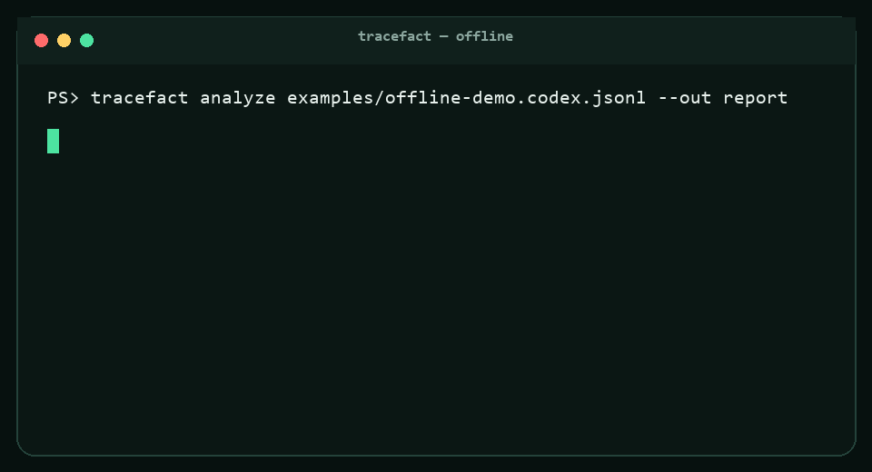

<p align="center"></p>

# TraceFact 中文说明

**让 Agent 运行结果有证据，而不是只有“我完成了”。**

TraceFact 把 Codex、Gemini CLI、Browser Use、JSONL 与 OpenTelemetry 轨迹转换为统一格式，生成“结论 → 工具结果 / 测试 / diff / 浏览器操作 / 产物哈希”的证据图、确定性失败定位和可校验回放包。默认本地运行，不需要 API Key，也不上传轨迹。



## 60 秒开始

```bash
git clone https://github.com/Alex0AI/tracefact.git
cd tracefact
npm ci
npm run build
node dist/cli.js analyze examples/offline-demo.codex.jsonl --out report
```

打开 `report/report.html`。同时会得到 JSON、Markdown、SARIF 和 `run.tracefact.gz` 回放包。也可以直接打开[在线演示](https://alex0ai.github.io/tracefact/)，把轨迹文件拖进页面；分析全部在浏览器本地完成。

## 为什么可信

- 不用一个不可解释的 LLM Judge 分数冒充正确率。
- 每一条失败诊断都包含具体事件 ID。
- 每项完成声明分为“有证据、弱证据、无证据、证据冲突”。
- 回放包用 SHA-256 校验；审查不需要原模型与 API Key。
- 明确展示缺失的 commit、测试、成本等不确定性。
- 不把不同 benchmark 的分数混成一个排行榜。

## 已完成能力

OATS 1.0 JSON Schema 与 TypeScript 类型、迁移工具、正式 Codex/Gemini CLI/Browser Use 适配器、通用 JSONL/OTel、3 个实验性适配器、证据图、9 类故障规则、脱敏、CLI、交互式 Web、独立 HTML 导出、GitHub Action、只读 MCP Server、60 条确定性样本、跨平台 CI 和完整开源文档。

## 实验边界

v0.1 的 precision/recall 来自规则编写者生成并标注的 60 条确定性合成轨迹，只能证明实现与规则标签一致，不能证明真实世界泛化能力。真实 Agent 轨迹误报研究、适配器版本兼容矩阵和跨项目基准是后续工作，详见[技术报告](docs/technical-report.md)与[路线图](ROADMAP.md)。

## 许可证

代码采用 Apache-2.0；确定性数据集采用 CC0-1.0。外部项目和数据仍遵循各自许可证，见 [THIRD_PARTY.md](THIRD_PARTY.md) 与 [DATA_SOURCES.md](DATA_SOURCES.md)。
